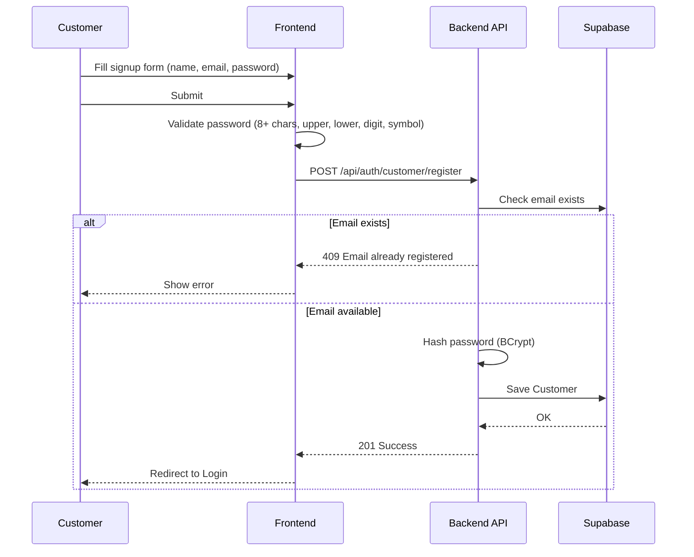
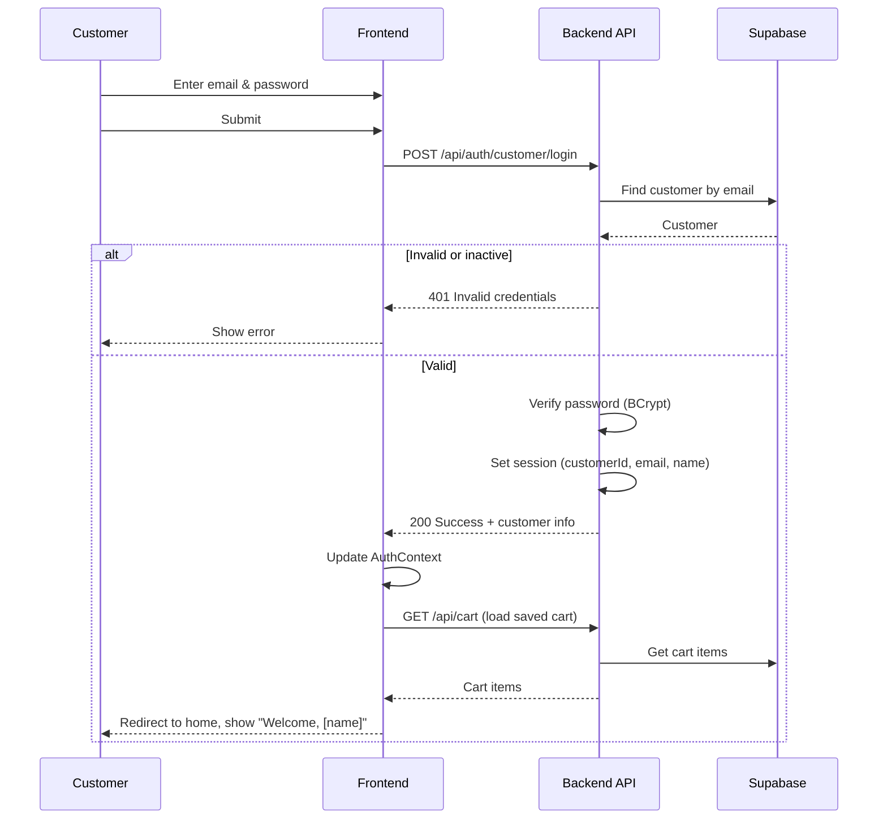
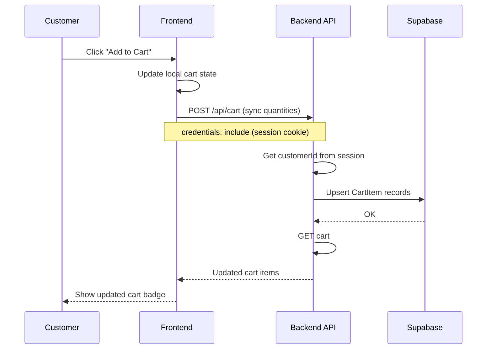
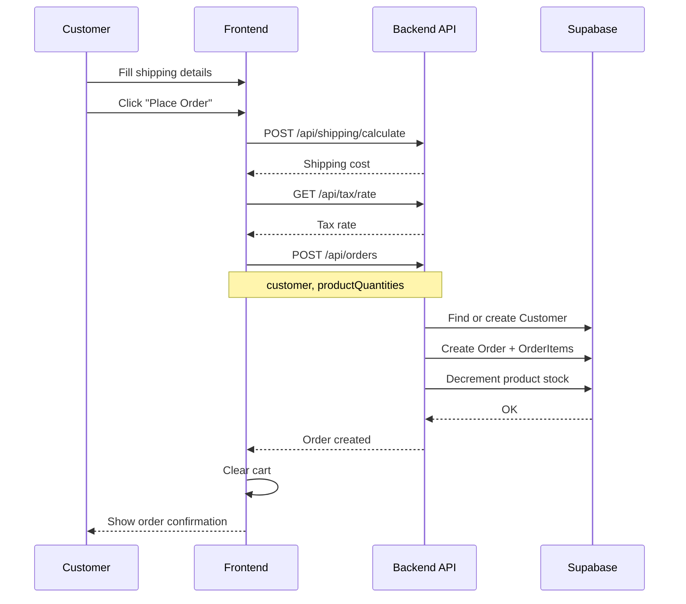
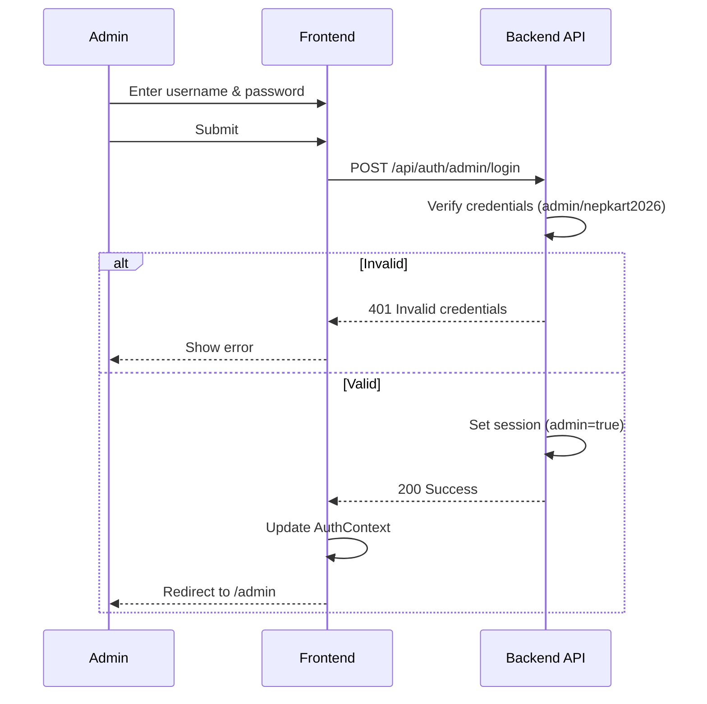
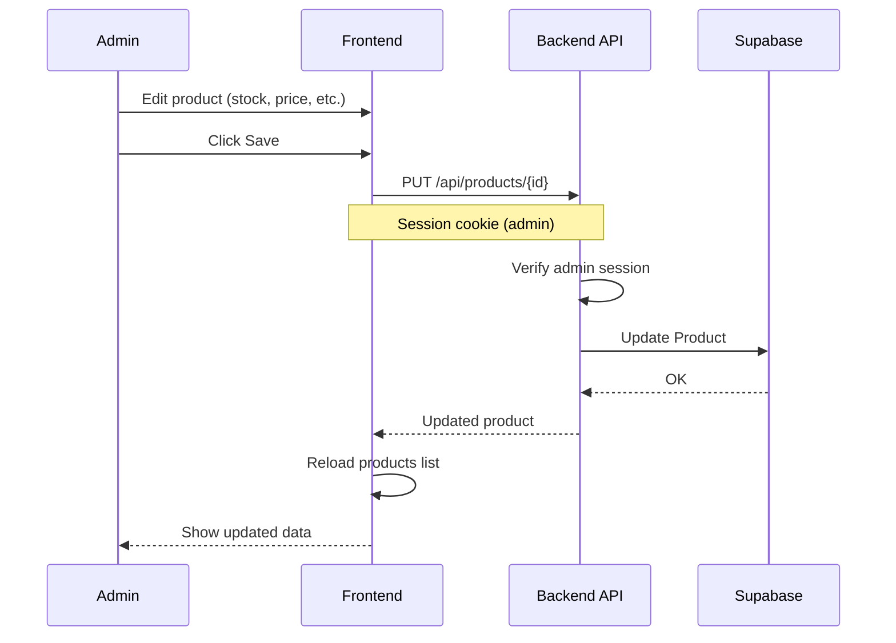

# NEPKART Sequence Diagrams

## Quick View (Mermaid – renders on GitHub)

### 1. Customer Sign Up



### 2. Customer Login



### 3. Add to Cart (Logged-in Customer)



### 4. Checkout / Place Order



### 5. Admin Login



### 6. Admin Update Product



### 7. Forgot Password / Reset Password

```mermaid
sequenceDiagram
    participant C as Customer
    participant F as Frontend
    participant B as Backend API
    participant DB as Supabase

    Note over C,F: Step 1: Request reset
    C->>F: Enter email on Forgot Password
    F->>B: POST /api/auth/customer/forgot-password
    B->>DB: Find customer by email
    B->>DB: Create PasswordResetToken (1hr expiry)
    B-->>F: 200 + token (dev: in response; prod: email)
    F-->>C: Redirect to Reset Password with token

    Note over C,F: Step 2: Reset with new password
    C->>F: Enter token, new password
    F->>B: POST /api/auth/customer/reset-password
    B->>DB: Validate token, find customer
    B->>B: Hash new password
    B->>DB: Update customer passwordHash
    B->>DB: Mark token used
    B-->>F: 200 Success
    F-->>C: Redirect to Login
```

---

## PlantUML Diagrams (for detailed view)

### Customer Sign Up

```
@startuml Customer-SignUp
actor Customer
participant "Frontend" as F
participant "Backend API" as B
database "Supabase" as DB

Customer -> F: Fill signup form
Customer -> F: Submit
F -> F: Validate password
F -> B: POST /auth/customer/register
B -> DB: findByEmail
alt Email exists
    B --> F: 409 Conflict
    F --> Customer: Show error
else OK
    B -> B: Hash password
    B -> DB: save(customer)
    B --> F: 201 Created
    F --> Customer: Redirect to Login
end
@enduml
```

### Customer Login

```
@startuml Customer-Login
actor Customer
participant "Frontend" as F
participant "Backend API" as B
database "Supabase" as DB

Customer -> F: Enter email & password
F -> B: POST /auth/customer/login
B -> DB: findByEmail
B -> B: verify password
B -> B: set session
B --> F: 200 + customer
F -> B: GET /cart
B -> DB: get cart
B --> F: cart items
F --> Customer: Welcome, [name]
@enduml
```

### Add to Cart

```
@startuml Add-To-Cart
actor Customer
participant "Frontend" as F
participant "Backend API" as B
database "Supabase" as DB

Customer -> F: Add to Cart
F -> F: Update local state
F -> B: POST /cart (sync)
B -> B: get customerId from session
B -> DB: sync CartItems
B --> F: cart
F --> Customer: Update badge
@enduml
```

### Checkout

```
@startuml Checkout
actor Customer
participant "Frontend" as F
participant "Backend API" as B
database "Supabase" as DB

Customer -> F: Place Order
F -> B: POST /shipping/calculate
B --> F: shipping cost
F -> B: POST /orders
B -> DB: create Order, OrderItems
B -> DB: decrement stock
B --> F: order
F -> F: clear cart
F --> Customer: Confirmation
@enduml
```

---

## How to View

1. **GitHub:** The Mermaid diagrams above render automatically in this file.
2. **PlantUML:** Copy the code blocks to [plantuml.com/plantuml](https://www.plantuml.com/plantuml/uml/) or use the `.puml` files in `docs/`.
3. **VS Code:** Install the PlantUML extension for preview.
