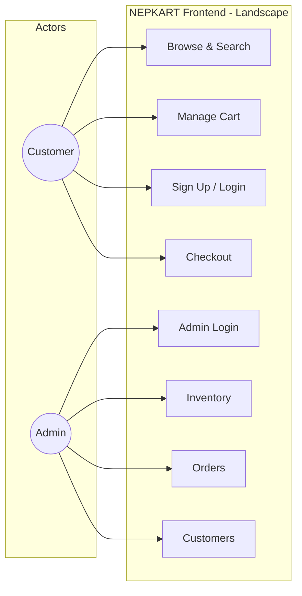
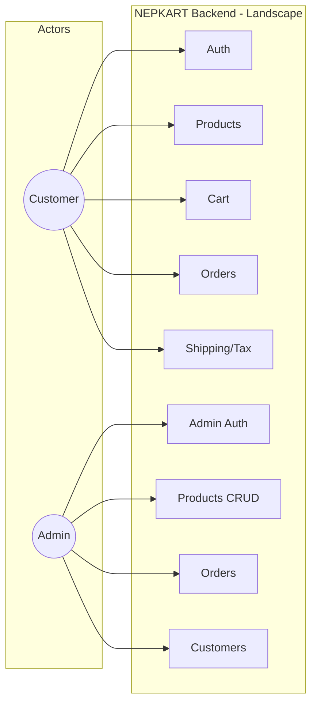

# NEPKART Use Case Diagrams

> See also: **[Sequence Diagrams](SEQUENCE_DIAGRAMS.md)** – Sign up, login, cart, checkout flows

## Quick View (Mermaid – renders on GitHub)

### Frontend Use Cases



### Backend Use Cases



---

## PlantUML Diagrams (for detailed view)

### Frontend Use Case Diagram

Compact landscape format for presentations. See `docs/use-case-frontend.puml`.

---

## Backend Use Case Diagram

Compact landscape format for presentations. See `docs/use-case-backend.puml`.

---

## How to View & Export (Landscape)

1. **Online (PNG/SVG):** Open [plantuml.com/plantuml](https://www.plantuml.com/plantuml/uml/), paste the `.puml` file content, then right-click the diagram → **Save image as** (PNG) or use the SVG/PDF links. The diagrams are already in landscape (1600×900).

2. **VS Code:** Install the "PlantUML" extension → right-click `.puml` file → **Export Current Diagram** → choose PNG/SVG. For landscape PDF: export as SVG, then open in a browser and print to PDF with landscape orientation.

3. **Command line:**
   ```bash
   plantuml -tpng docs/use-case-frontend.puml
   plantuml -tpng docs/use-case-backend.puml
   ```

---

## Summary Tables

### Frontend Use Cases by Actor

| Customer | Admin |
|----------|-------|
| Browse Products | Admin Login |
| Search Products | Admin Logout |
| View Product Details | View Inventory |
| Add to Cart | Add Product |
| Update Cart Quantity | Edit Product |
| Remove from Cart | Delete Product |
| View Cart | View Orders |
| Create Account | Update Order Status |
| Customer Login | View Customers |
| Customer Logout | Activate/Deactivate Customer |
| Forgot Password | |
| Reset Password | |
| Place Order | |

### Backend API Endpoints by Actor

| Customer | Admin |
|----------|-------|
| POST /auth/customer/register | POST /auth/admin/login |
| POST /auth/customer/login | GET /products, /products/{id} |
| POST /auth/customer/forgot-password | GET /products/low-stock, /out-of-stock |
| POST /auth/customer/reset-password | POST /products |
| POST /auth/logout | PUT /products/{id} |
| GET /products, /products/{id} | DELETE /products/{id} |
| GET/POST /cart | GET /orders, /orders/{id} |
| POST /orders | PUT /orders/{id}/status |
| POST /shipping/calculate | DELETE /orders/{id} |
| GET /tax/rate | GET /customers |
| | PUT /customers/{id}/active |
