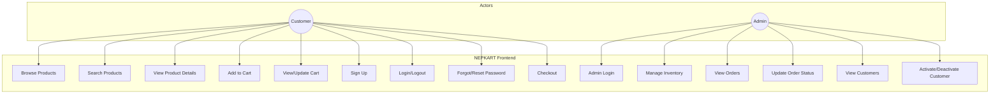
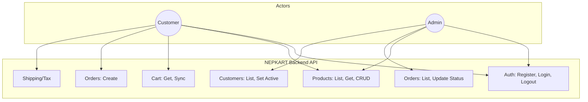

# NEPKART Use Case Diagrams

## Quick View (Mermaid – renders on GitHub)

### Frontend Use Cases



### Backend Use Cases



---

## PlantUML Diagrams (for detailed view)

### Frontend Use Case Diagram

The React application provides these use cases to users:

```
@startuml NEPKART-Frontend-UseCases
!theme plain
skinparam actorStyle awesome
skinparam useCase {
  BackgroundColor LightBlue
  BorderColor DarkBlue
}

left to right direction

actor "Customer" as Customer
actor "Admin" as Admin

rectangle "NEPKART Frontend (React)" {
  ' Customer use cases
  usecase "Browse Products" as UC1
  usecase "Search Products" as UC2
  usecase "View Product Details" as UC3
  usecase "Add to Cart" as UC4
  usecase "Update Cart Quantity" as UC5
  usecase "Remove from Cart" as UC6
  usecase "View Cart" as UC7
  usecase "Create Account (Sign Up)" as UC8
  usecase "Customer Login" as UC9
  usecase "Customer Logout" as UC10
  usecase "Forgot Password" as UC11
  usecase "Reset Password" as UC12
  usecase "Place Order (Checkout)" as UC13

  ' Admin use cases
  usecase "Admin Login" as UC14
  usecase "Admin Logout" as UC15
  usecase "View Inventory" as UC16
  usecase "Add Product" as UC17
  usecase "Edit Product" as UC18
  usecase "Delete Product" as UC19
  usecase "View Orders" as UC20
  usecase "Update Order Status" as UC21
  usecase "View Customers" as UC22
  usecase "Activate/Deactivate Customer" as UC23
}

' Customer associations
Customer --> UC1
Customer --> UC2
Customer --> UC3
Customer --> UC4
Customer --> UC5
Customer --> UC6
Customer --> UC7
Customer --> UC8
Customer --> UC9
Customer --> UC10
Customer --> UC11
Customer --> UC12
Customer --> UC13

' Admin associations
Admin --> UC14
Admin --> UC15
Admin --> UC16
Admin --> UC17
Admin --> UC18
Admin --> UC19
Admin --> UC20
Admin --> UC21
Admin --> UC22
Admin --> UC23

' Include relationships
UC13 ..> UC7 : <<include>>
UC4 ..> UC1 : <<include>>
@enduml
```

---

## Backend Use Case Diagram

The Spring Boot API exposes these use cases (invoked by the Frontend on behalf of users):

```
@startuml NEPKART-Backend-UseCases
!theme plain
skinparam actorStyle awesome
skinparam useCase {
  BackgroundColor LightGreen
  BorderColor DarkGreen
}

left to right direction

actor "Customer\n(via Frontend)" as Customer
actor "Admin\n(via Frontend)" as Admin

rectangle "NEPKART Backend (Spring Boot API)" {
  ' Auth
  usecase "Admin Login" as B1
  usecase "Customer Register" as B2
  usecase "Customer Login" as B3
  usecase "Logout" as B4
  usecase "Forgot Password" as B5
  usecase "Reset Password" as B6
  usecase "Check Auth Session" as B7

  ' Products
  usecase "List Products" as B8
  usecase "Get Product by ID" as B9
  usecase "Get Low Stock Products" as B10
  usecase "Get Out of Stock Products" as B11
  usecase "Create Product" as B12
  usecase "Update Product" as B13
  usecase "Delete Product" as B14

  ' Orders
  usecase "List Orders" as B15
  usecase "Get Order by ID" as B16
  usecase "Create Order" as B17
  usecase "Update Order Status" as B18
  usecase "Delete Order" as B19

  ' Cart
  usecase "Get Cart" as B20
  usecase "Sync Cart" as B21

  ' Customers
  usecase "List Customers" as B22
  usecase "Set Customer Active/Inactive" as B23

  ' Supporting
  usecase "Calculate Shipping" as B24
  usecase "Get Tax Rate" as B25
}

' Customer associations
Customer --> B2
Customer --> B3
Customer --> B4
Customer --> B5
Customer --> B6
Customer --> B8
Customer --> B9
Customer --> B20
Customer --> B21
Customer --> B17
Customer --> B24
Customer --> B25

' Admin associations
Admin --> B1
Admin --> B4
Admin --> B8
Admin --> B9
Admin --> B10
Admin --> B11
Admin --> B12
Admin --> B13
Admin --> B14
Admin --> B15
Admin --> B16
Admin --> B18
Admin --> B19
Admin --> B22
Admin --> B23

@enduml
```

---

## How to View the Diagrams

1. **Online:** Copy the PlantUML code (between `@startuml` and `@enduml`) and paste at [plantuml.com/plantuml](https://www.plantuml.com/plantuml/uml/)

2. **VS Code:** Install the "PlantUML" extension, then open the `.puml` file or this markdown and use the preview.

3. **Command line:** If you have PlantUML installed:
   ```bash
   plantuml docs/use-cases.puml
   ```

---

## Summary Tables

### Frontend Use Cases by Actor

| Customer | Admin |
|----------|-------|
| Browse Products | Admin Login |
| Search Products | Admin Logout |
| View Product Details | View Inventory |
| Add to Cart | Add Product |
| Update Cart Quantity | Edit Product |
| Remove from Cart | Delete Product |
| View Cart | View Orders |
| Create Account | Update Order Status |
| Customer Login | View Customers |
| Customer Logout | Activate/Deactivate Customer |
| Forgot Password | |
| Reset Password | |
| Place Order | |

### Backend API Endpoints by Actor

| Customer | Admin |
|----------|-------|
| POST /auth/customer/register | POST /auth/admin/login |
| POST /auth/customer/login | GET /products, /products/{id} |
| POST /auth/customer/forgot-password | GET /products/low-stock, /out-of-stock |
| POST /auth/customer/reset-password | POST /products |
| POST /auth/logout | PUT /products/{id} |
| GET /products, /products/{id} | DELETE /products/{id} |
| GET/POST /cart | GET /orders, /orders/{id} |
| POST /orders | PUT /orders/{id}/status |
| POST /shipping/calculate | DELETE /orders/{id} |
| GET /tax/rate | GET /customers |
| | PUT /customers/{id}/active |
